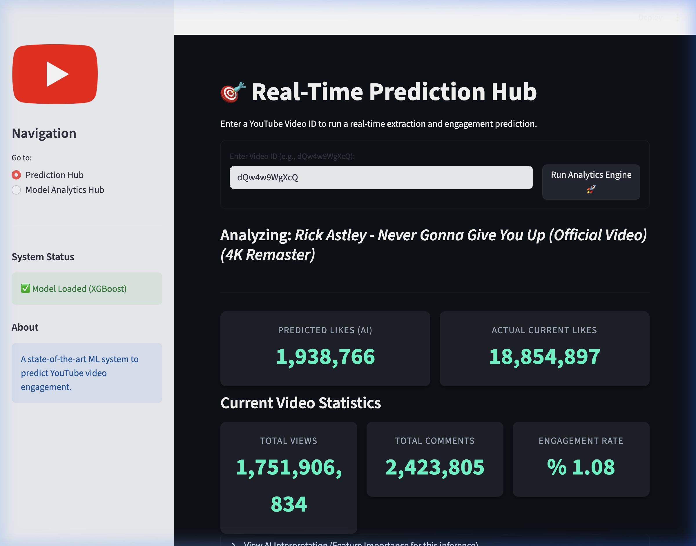
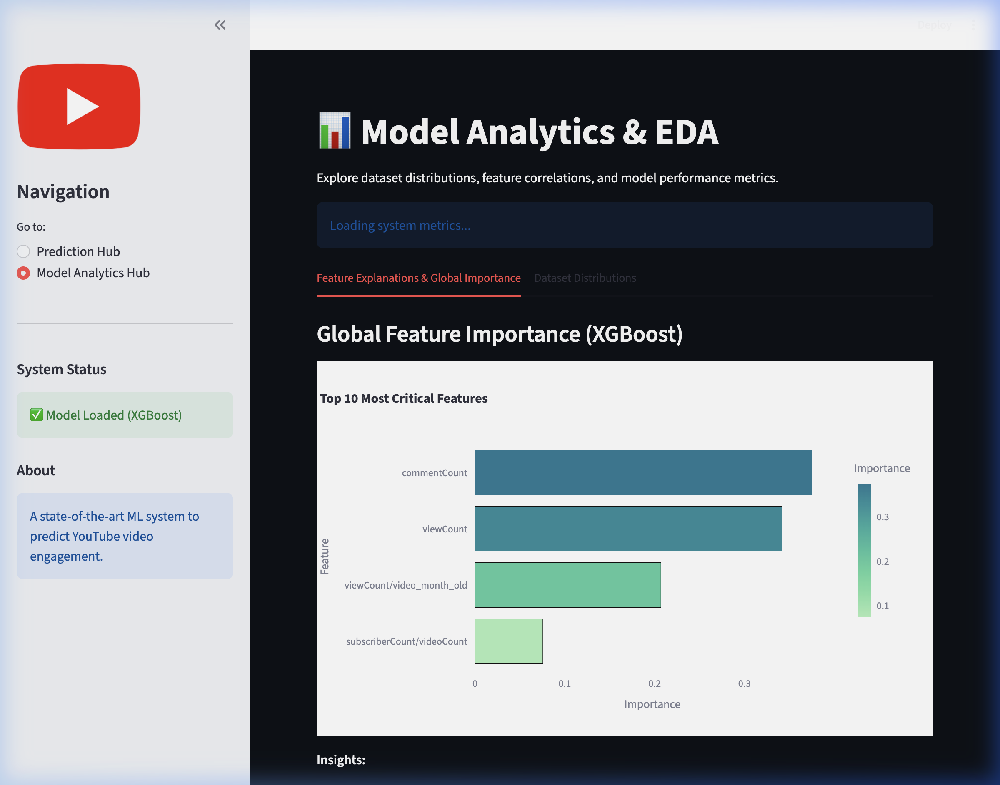

# 🚀 YouTube Video Engagement Predictor (AI)


An advanced, end-to-end Machine Learning ecosystem designed to predict the engagement (like counts) of YouTube videos with high accuracy. This project extracts real-time metadata via the YouTube Data API v3, performs advanced feature engineering, and serves predictions via a highly optimized XGBoost regression model housed within a beautifully designed Streamlit interface.

---

## 🌟 Key Features

*   **Real-time Inference Engine:** Enter any valid YouTube Video ID, and the application instantly fetches current video and channel statistics to run a live prediction.
*   **Advanced Feature Engineering:** Computes interaction ratios (e.g., comments per view, channel views per subscriber), logarithmic transformations of highly skewed distributions, and age-decay temporal features.
*   **State-of-the-Art Modeling:** Replaced legacy models with a well-tuned **XGBoost Regressor**, achieving excellent bounds on Mean Absolute Error (MAE).
*   **Interactive Analytics Dashboard:** A multi-page Streamlit application that visualizes dataset distributions and global feature importance using `Plotly`.
*   **Production-Ready MLOps:** Containerized via Docker for seamless deployment across any cloud architecture.
---

## 📊 Visual Results

### Real-Time Prediction Hub
The application provides an intuitive interface for real-time engagement prediction.


### Model Analytics & Global Explainability
Explore global feature importance and dataset distributions.


---

## 🏗️ System Architecture

1.  **Ingestion (`src/data/get_data.py`):** Queries the Google API to collect nested JSON metadata for videos and their parent channels.
2.  **Processing (`src/features/build_features.py`):** Transforms raw JSON into a highly optimized tabular format utilizing pandas.
3.  **Modeling (`src/models/train_xgboost.py`):** Trains the core XGBoost algorithm and exports `.joblib` artifacts.
4.  **Serving (`app/main.py`):** A Streamlit front-end acts as the bridge between model artifacts and the end user.

---

## ⚡ Quickstart Guide

### Option A: Local Virtual Environment

1. **Clone the repository:**
   ```bash
   git clone https://github.com/YourUsername/YouTube-Like-Predictor.git
   cd YouTube-Like-Predictor
   ```

2. **Setup virtual environment & dependencies:**
   ```bash
   python3 -m venv venv
   source venv/bin/activate  # On Windows: venv\Scripts\activate
   pip install -r requirements.txt
   ```

3. **Configure API Keys:**
   Create a `.env` file in the root directory and add your Google Cloud API Key.
   ```bash
   cp .env.example .env
   # Edit .env with your YOUTUBE_API_KEY
   ```

> [!CAUTION]
> ### 🚫 Why you should NOT upload .env
> **If you push your API key:**
> *   ❌ **Anyone can steal and use it**
> *   ❌ **Your quota (10,000/day) will get exhausted**
> *   ❌ **Worst case → misuse → billing issues**
> 
> Always ensure `.env` is listed in your `.gitignore` file before pushing to any public repository.

4. **Launch the Application:**
   ```bash
   PYTHONPATH=. streamlit run app/main.py
   ```

### Option B: Docker (Recommended)

1. Build the container image:
   ```bash
   docker build -t youtube-predictor-ai .
   ```
2. Run the container, passing in your local `.env`:
   ```bash
   docker run -p 8501:8501 --env-file .env youtube-predictor-ai
   ```

---

## 🧠 Model Details & Evaluation

*   **Algorithm:** `xgboost.XGBRegressor`
*   **Optimization:** Minimizing `reg:squarederror`
*   **Global Explainability:** The system calculates real-time feature importance, consistently finding that `log_view_count`, `log_comment_count`, and the `comments_per_view` ratio are the strongest indicators of total like sentiment.

## 📂 Project Structure

```text
├── README.md              <- High-level documentation
├── Dockerfile             <- Docker container instructions
├── requirements.txt       <- Production dependencies
├── .env.example           <- Environment configuration template
├── app/
│   └── main.py            <- Streamlit application logic
├── notebooks/
│   └── *.ipynb            <- Exploratory Data Analysis notebooks (EDA)
├── models/
│   └── *.joblib           <- Serialized XGBoost models and feature lists
└── src/
    ├── data/              <- Scripts to interact with YouTube API
    ├── features/          <- Feature scaling, transformation, and creation
    └── models/            <- Model training pipelines
```
